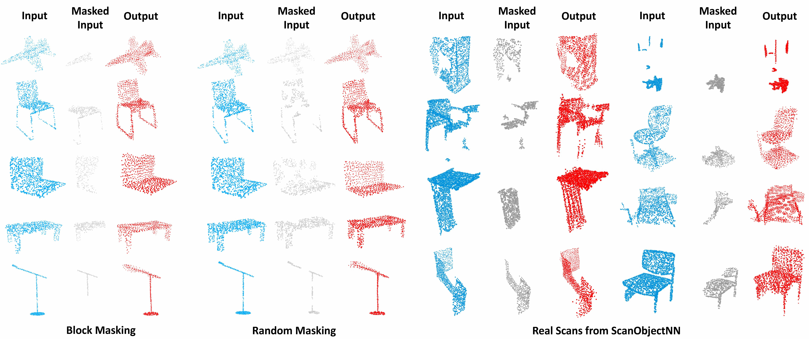

# Point-BERT: Pre-Training 3D Point Cloud Transformers with Masked Point Modeling

<!-- [](https://paperswithcode.com/sota/point-cloud-completion-on-shapenet?p=pointr-diverse-point-cloud-completion-with) -->

Created by [Xumin Yu](https://yuxumin.github.io/)\*, [Lulu Tang](https://github.com/lulutang0608)\*, [Yongming Rao](https://raoyongming.github.io/)\*, [Tiejun Huang](http://www.ai.pku.edu.cn/info/1139/1243.htm), [Jie Zhou](https://scholar.google.com/citations?user=6a79aPwAAAAJ&hl=en&authuser=1), [Jiwen Lu](https://scholar.google.com/citations?user=TN8uDQoAAAAJ&hl=en&authuser=1)

[[arXiv]]() [[Project Page]](https://point-bert.ivg-research.xyz/) [[Models]](#pretrained-models)

This repository contains PyTorch implementation for __Point-BERT:Pre-Training 3D Point Cloud Transformers with Masked Point Modeling__.

Point-BERT is a novel paradigm for learning Transformers to generalize the concept of BERT onto 3D point cloud. Following BERT, we devise a Masked Point Modeling (MPM) task to pre-train point cloud Transformers. Specifically, we first divide a point cloud into several local patches, and a point cloud Tokenizer is devised via a discrete Variational AutoEncoder (dVAE) to generate discrete point tokens containing meaningful local information. Then, we randomly mask some patches of input point clouds and feed them into the backbone Transformer. The pre-training objective is to recover the original point tokens at the masked locations under the supervision of point tokens obtained by the Tokenizer.


<!-- ## 🔥News
- **2021-11-26** Code and Pretrained weight released. -->

## Pretrained Models

|model| dataset | config | url|
| :---: | :---: | :---: |  :---: | 
| dVAE |ShapeNet |  [config](cfgs/ShapeNet55_models/dvae.yaml)|  [Tsinghua Cloud](https://cloud.tsinghua.edu.cn/f/c76274f9afb34cdbb57e/?dl=1) / [BaiDuYun](https://pan.baidu.com/s/1tiO5nYmkQ8jesPNPVWrdYQ)(code:26d3) |
|Point-BERT| ShapeNet |  [config](cfgs/Mixup_models/Point-BERT.yaml)|  [Tsinghua Cloud](https://cloud.tsinghua.edu.cn/f/202b29805eea45d7be92/?dl=1) / [BaiDuYun](https://pan.baidu.com/s/1O0_9MYVTGcPcbBccfXZuog)(code:jvtg) |

|model| dataset  | Acc. | Acc. (vote) | config | url|
| :---:| :---: | :---: |  :---: | :---: | :---: |
| Transformer| ModelNet | 92.67 | 93.24 |  [config](cfgs/ModelNet_models/PointTransformer.yaml) | [Tsinghua Cloud](https://cloud.tsinghua.edu.cn/f/9be5d9dcbaeb48adb360/?dl=1) / [BaiDuYun](https://pan.baidu.com/s/1Ykb9UwOeZRDXGwYZpO_AAg )(code:tqow) |
| Transformer| ModelNet | 92.91 | 93.48 |[config](cfgs/ModelNet_models/PointTransformer_4096point.yaml) | [Tsinghua Cloud](https://cloud.tsinghua.edu.cn/f/121b2651374e4ab1ade6/?dl=1) / [BaiDuYun](https://pan.baidu.com/s/1n2GIrOX93hpO5pgmV0Q1vw)(code:tcin) | 
| Transformer| ModelNet | 93.19 |93.76 | [config](cfgs/ModelNet_models/PointTransformer_8192point.yaml) |  [Tsinghua Cloud](https://cloud.tsinghua.edu.cn/f/3ee8e437e07f4dc49738/?dl=1) / [BaiDuYun](https://pan.baidu.com/s/1o5DsEbPPA85dvuVuim8Y1Q)(code:k343) |
| Transformer| ScanObjectNN |88.12| -- |[config](cfgs/ScanObjectNN_models/PointTransformer_objectonly.yaml)| [Tsinghua Cloud](https://cloud.tsinghua.edu.cn/f/60260a3cbd8940f5bf0d/?dl=1) / [BaiDuYun](https://pan.baidu.com/s/1ZH0mLlJKmtB22xUUALP-dQ)(code:f0km) | 
| Transformer| ScanObjectNN |87.43| -- | [config](cfgs/ScanObjectNN_models/PointTransformer_objectbg.yaml) |[Tsinghua Cloud](https://cloud.tsinghua.edu.cn/f/c66c28c771e24cd588ad/?dl=1) / [BaiDuYun](https://pan.baidu.com/s/1nPiiDnV3qDmDqD17FW5rUg)(code:k3cb) | 
| Transformer| ScanObjectNN |83.07| -- | [config](cfgs/ScanObjectNN_models/PointTransformer_hardest.yaml) |[Tsinghua Cloud](https://cloud.tsinghua.edu.cn/f/2edb5b2810dc4bd9b796/?dl=1) / [BaiDuYun](https://pan.baidu.com/s/1ehxb9QPB2nkKYJixEMZeuw)(code:rxsw) | 


## Usage

### Requirements

- PyTorch >= 1.7.0
- python >= 3.7
- CUDA >= 9.0
- GCC >= 4.9 
- torchvision
- timm
- open3d
- tensorboardX

```
pip install -r requirements.txt
```

#### Building Pytorch Extensions for Chamfer Distance, PointNet++ and kNN

*NOTE:* PyTorch >= 1.7 and GCC >= 4.9 are required.

```
# Chamfer Distance
bash install.sh
# PointNet++
pip install "git+git://github.com/erikwijmans/Pointnet2_PyTorch.git#egg=pointnet2_ops&subdirectory=pointnet2_ops_lib"
# GPU kNN
pip install --upgrade https://github.com/unlimblue/KNN_CUDA/releases/download/0.2/KNN_CUDA-0.2-py3-none-any.whl
```

### Dataset

We use **ShapeNet** for the training of dVAE and the pre-training of Point-BERT models. And finetuning the Point-BERT models on **ModelNet**, **ScanObjectNN**, **ShapeNetPart**

The details of used datasets can be found in [DATASET.md](./DATASET.md).


### dVAE
To train a dVAE by yourself, simply run: 
```
bash scripts/train.sh <GPU_IDS>\
    --config cfgs/ShapeNet55_models/dvae.yaml \
    --exp_name <name>
```

Visualize the reconstruction results of a pre-trained dVAE, run: (default path: `./vis`)
```
bash ./scripts/test.sh <GPU_IDS> \
    --ckpts <path>\
    --config cfgs/ShapeNet55_models/dvae.yaml\
    --exp_name <name>
```

### Point-BERT pre-train
To pre-train the Point-BERT models on ShapeNet, simply run:
(complete the `ckpt` in `cfgs/Mixup_models/Point-BERT.yaml` first )
```
bash ./scripts/dist_train_BERT.sh <NUM_GPU> <port>\
    --config cfgs/Mixup_models/Point-BERT.yaml \
    --exp_name pointBERT_pretrain 
    [--val_freq 10]
```
*val_freq* controls the frequence to evaluate the Transformer on ModelNet40 with LinearSVM.

### Downstream finutuning
We finetune our Point-BERT on 4 downstream tasks: Classfication on ModelNet40, Few-shot learning on ModelNet40, Transfer learning on ScanObjectNN and Part segmentation on ShapeNetPart.

#### ModelNet40
To finetune a pre-trained Point-BERT model on ModelNet40, simply run:
```
# 1024 points
bash ./scripts/train_BERT.sh <GPU_IDS> \
    --config cfgs/ModelNet_models/PointTransformer.yaml\
    --finetune_model\
    --ckpts <path>\
    --exp_name <name>
# 4096 points
bash ./scripts/train_BERT.sh <GPU_IDS>\
    --config cfgs/ModelNet_models/PointTransformer_4096point.yaml\ 
    --finetune_model\ 
    --ckpts <path>\
    --exp_name <name>
# 8192 points
bash ./scripts/train_BERT.sh <GPU_IDS>\
    --config cfgs/ModelNet_models/PointTransformer_8192point.yaml\ 
    --finetune_model\ 
    --ckpts <path>\
    --exp_name <name>
```

To evaluate a model finetuned on ModelNet40, simply run:
```
bash ./scripts/test_BERT.sh <GPU_IDS>\
    --config cfgs/ModelNet_models/PointTransformer.yaml \
    --ckpts <path> \
    --exp_name <name>
```

#### Few-shot Learning on ModelNet40
We follow the few-shot setting in the previous work.

First, generate your own few-shot learning split or use the same split as us (see [DATASET.md](./DATASET.md)).
```
# generate few-shot learning split
cd datasets/
python generate_few_shot_data.py
# train and evaluate the Point-BERT
bash ./scripts/train_BERT.sh <GPU_IDS> \
    --config cfgs/Fewshot_models/PointTransformer.yaml \
    --finetune_model \
    --ckpts <path> \
    --exp_name <name> \
    --way <int> \
    --shot <int> \
    --fold <int>
```

#### ScanObjectNN
To finetune a pre-trained Point-BERT model on ScanObjectNN, simply run:
```
bash ./scripts/train_BERT.sh <GPU_IDS>  \
    --config cfgs/ScanObjectNN_models/PointTransformer_hardest.yaml \
    --finetune_model \
    --ckpts <path> \
    --exp_name <name>
```

To evaluate a model on ScanObjectNN, simply run:
```
bash ./scripts/test_BERT.sh <GPU_IDS>\
    --config cfgs/ScanObjectNN_models/PointTransformer_hardest.yaml \
    --ckpts <path> \
    --exp_name <name>
```

#### Part Segmentation
Code coming soon

### Visualization
Masked point clouds reconstruction using our Point-BERT model trained on ShapeNet



## License
MIT License

## Citation
If you find our work useful in your research, please consider citing: 
```
@article{yu2021pointbert,
  title={Point-BERT: Pre-Training 3D Point Cloud Transformers with Masked Point Modeling},
  author={Yu, Xumin and Tang, Lulu and Rao, Yongming and Huang, Tiejun and Zhou, Jie and Lu, Jiwen},
  journal={arXiv preprint},
  year={2021}
}
```
